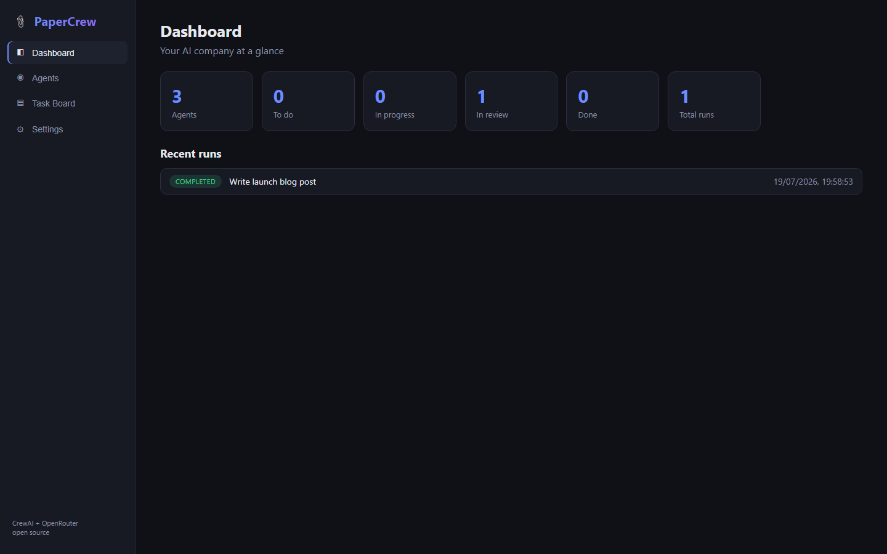
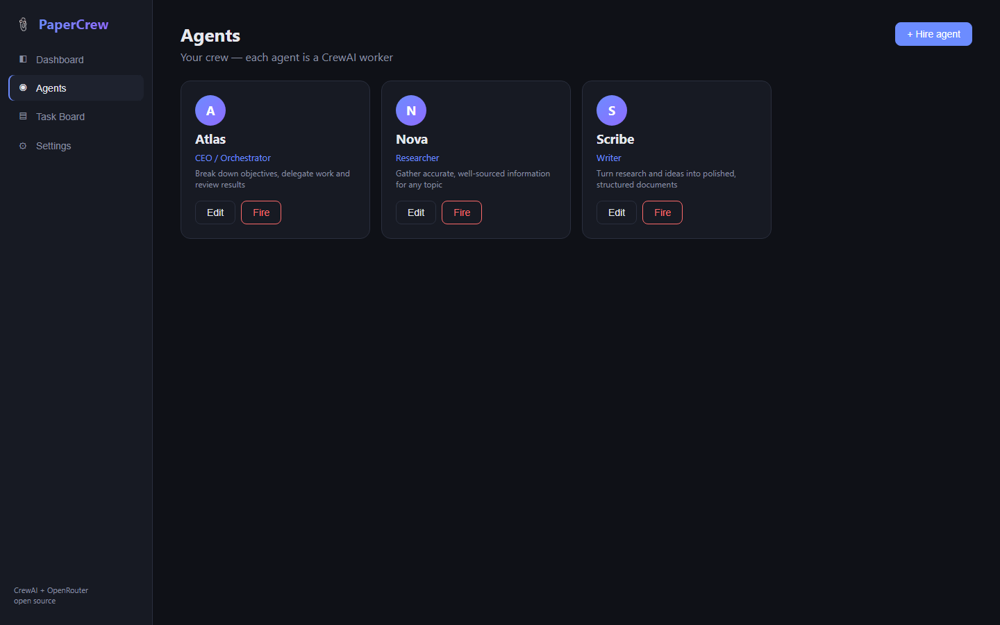
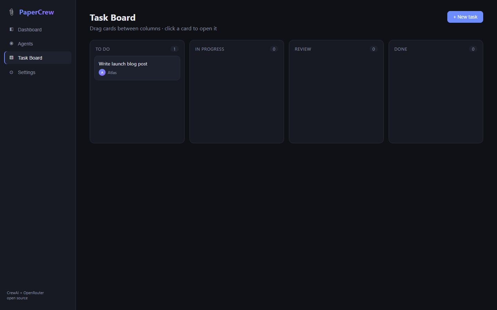
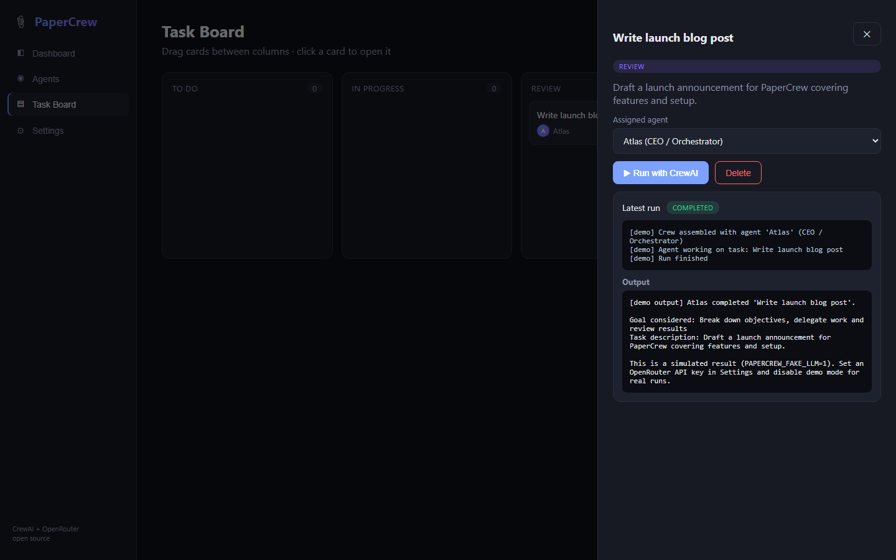

# 📎 PaperCrew

**A Paperclip-style UI for CrewAI — free OpenRouter models by default.**

PaperCrew combines the best of two worlds:

- **Paperclip-style frontend** — a friendly dashboard to manage your AI "company": agents, a kanban task board, live run output, and settings. No YAML, no code required.
- **CrewAI backend** — every task run is executed by an open-source [CrewAI](https://github.com/crewAIinc/crewAI) crew, which is dramatically more token-efficient than heavyweight orchestrators.
- **OpenRouter by default** — ships pointing at a **free** model (`meta-llama/llama-3.3-70b-instruct:free`), so you can try it without spending a cent. Any OpenRouter model works.

> Problema resolvido (PT-BR): o Paperclip tem ótima interface mas a orquestração consome muitos tokens; o CrewAI é eficiente mas não tem interface amigável. O PaperCrew junta os dois — interface estilo Paperclip + orquestração CrewAI + modelos gratuitos via OpenRouter.

## Screenshots

| Dashboard | Agents |
|---|---|
|  |  |

| Task board | Run output (CrewAI) |
|---|---|
|  |  |

## Architecture

```
frontend (React + Vite + TS, port 5173)
   │  /api proxy
   ▼
backend (FastAPI, port 8000)
   │
   ├─ SQLite (agents, tasks, runs, settings)
   └─ crew_runner ──► CrewAI Agent/Task/Crew ──► OpenRouter (free model default)
```

- **Agent** = a CrewAI agent (role, goal, backstory, optional model override)
- **Task** = kanban card; assign an agent and hit **Run with CrewAI**
- **Run** = one crew kickoff; status, log and output are polled live by the UI

## Quick start

Requirements: Python 3.10–3.13, Node 18+.

```bash
git clone https://github.com/CarlosMagnoSTavares/papercrew
cd papercrew

# backend
python -m venv .venv
.venv/Scripts/pip install -r backend/requirements.txt      # Windows
# .venv/bin/pip install -r backend/requirements.txt        # Linux/macOS
cd backend && ../.venv/Scripts/python -m uvicorn app.main:app --port 8000

# frontend (new terminal)
cd frontend && npm install && npm run dev
```

Open http://localhost:5173, go to **Settings**, paste your [OpenRouter API key](https://openrouter.ai/keys) (free tier works), and run a task from the board.

### Demo mode (no API key, zero tokens)

```bash
PAPERCREW_FAKE_LLM=1 python -m uvicorn app.main:app --port 8000
```

Runs are simulated — perfect for exploring the UI and for CI tests.

## Configuration

| Setting | Where | Default |
|---|---|---|
| OpenRouter API key | Settings page (or `OPENROUTER_API_KEY` env) | — |
| Default model | Settings page | `meta-llama/llama-3.3-70b-instruct:free` |
| Per-agent model | Agent form, "Model override" | inherits default |
| Demo mode | `PAPERCREW_FAKE_LLM=1` env | off |
| DB path | `PAPERCREW_DB` env | `backend/papercrew.db` |

## Tests

```bash
cd backend && ../.venv/Scripts/python -m pytest tests/ -v
```

7 API tests cover CRUD, validation, settings and a full (demo-mode) crew run. Evidence in [docs/evidence](docs/evidence).

## Roadmap / contributing

PRs welcome! Ideas: multi-agent crews per task, hierarchical process, streaming output (SSE), agent chat, tools (web search, files), Docker compose.

## License

[MIT](LICENSE)
