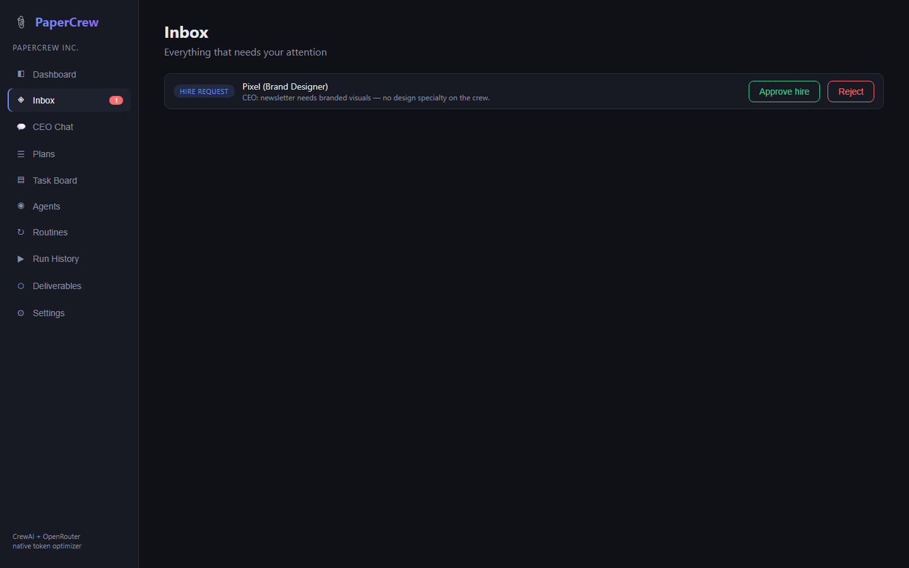
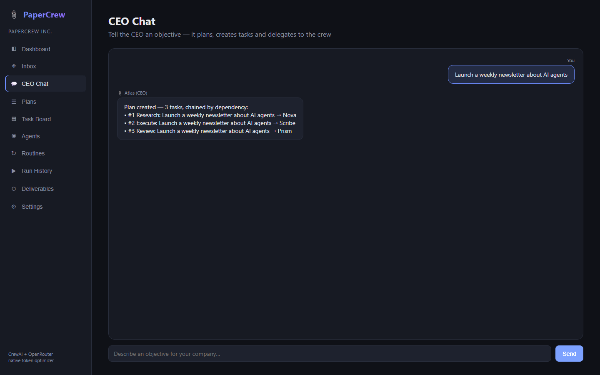
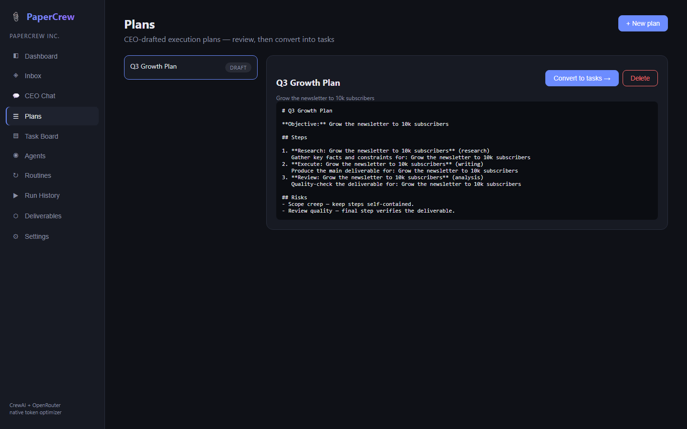
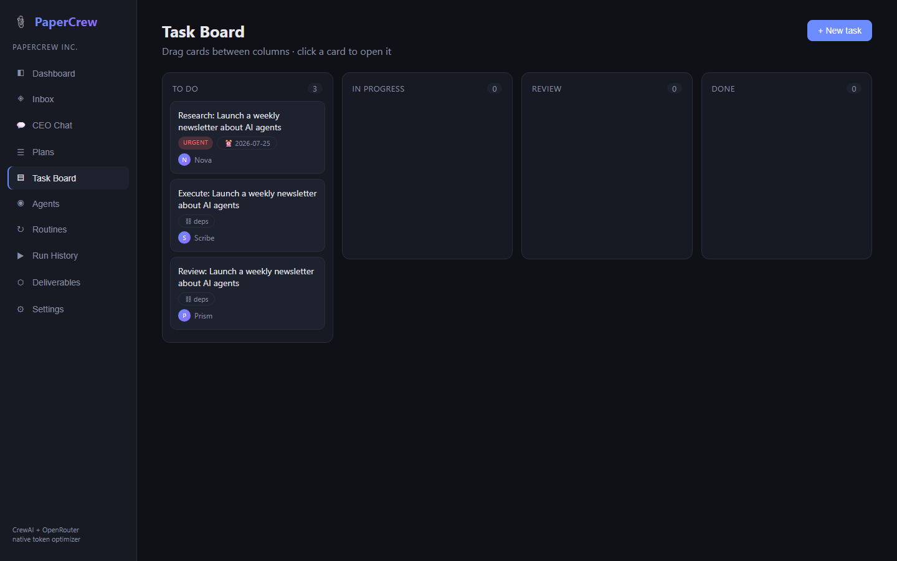
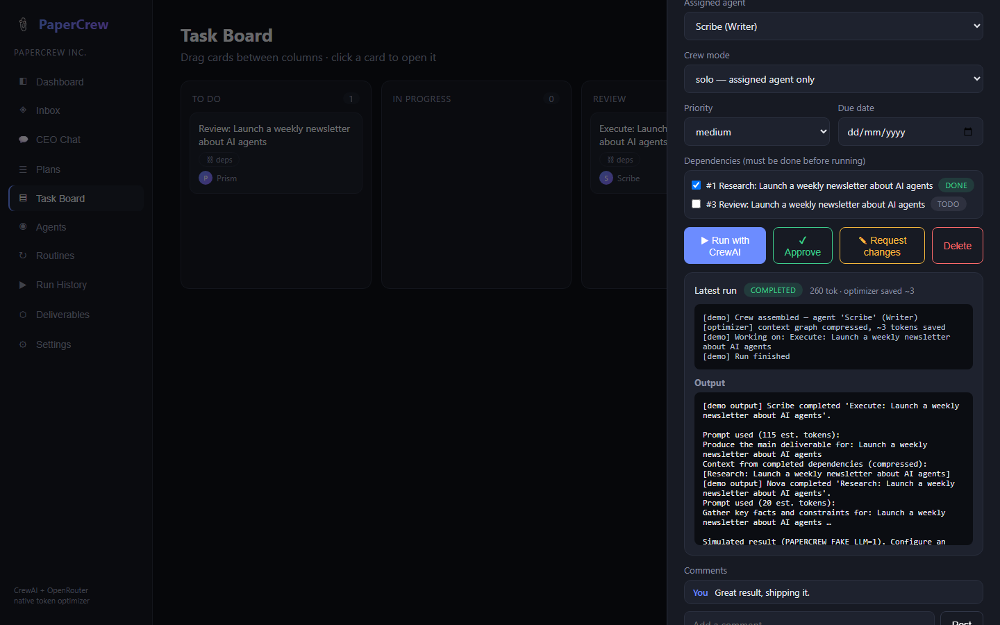
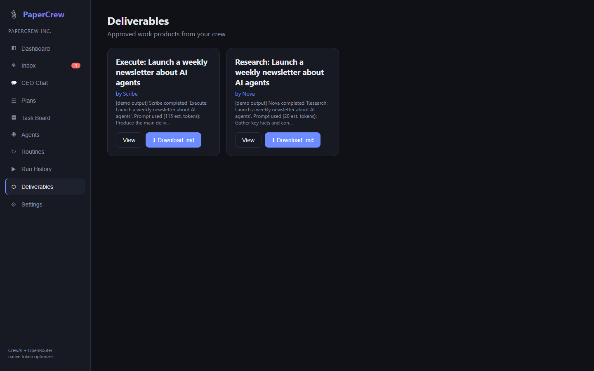
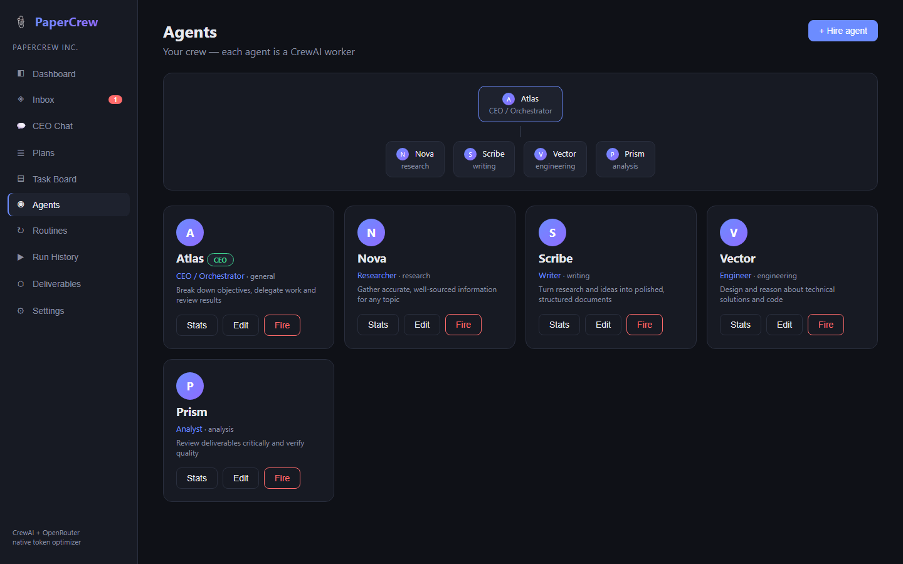
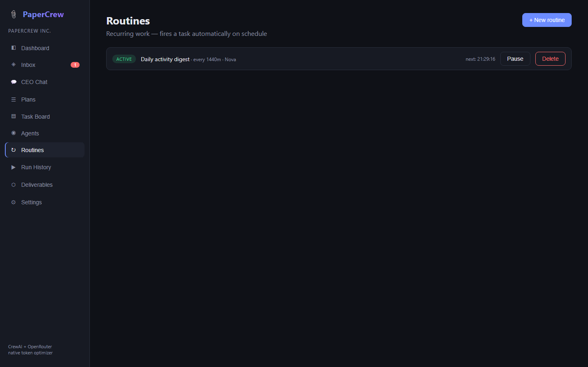

# 📎 PaperCrew

**A Paperclip-style AI company control plane, powered by open-source CrewAI — with a native token optimizer and free OpenRouter models by default.**

PaperCrew solves two problems at once:

- **Paperclip** has a great "AI company" UX but its orchestration burns a lot of tokens.
- **CrewAI** is efficient and open source but has no friendly interface.

PaperCrew gives you the Paperclip experience (CEO chat, delegation, task board, approvals, routines, cost oversight) on top of CrewAI orchestration, wired to OpenRouter with a **free** model as default (`meta-llama/llama-3.3-70b-instruct:free`) — and it actively reduces token usage on every single run.

> PT-BR: interface estilo Paperclip + orquestração CrewAI + otimização nativa de tokens + modelos gratuitos via OpenRouter.

## Features

| Feature | How it works |
|---|---|
| **CEO Chat** | Describe an objective; the CEO agent breaks it into 2–4 tasks, chains them by dependency and delegates each to the best-fit agent by specialty |
| **Plans** | The CEO drafts a markdown execution plan from your objective; review it, then convert it into dependency-chained tasks with one click |
| **Inbox** | Everything needing your attention in one place: results to review, pending hire requests, failed runs, unassigned tasks — with a live badge |
| **Governance hiring** | Agents join via hire requests that you approve or reject; the CEO files hire requests automatically when a plan needs an uncovered specialty |
| **Agents & org chart** | Hire/fire CrewAI agents with role, goal, backstory, specialty, model override; org chart view and per-agent performance stats (tasks, runs, tokens, cost) |
| **Task board** | Kanban (todo → in progress → review → done) with drag & drop, priorities (low→urgent), due dates with overdue highlighting |
| **Dependencies** | Tasks can depend on other tasks; runs are blocked until dependencies are done, and their outputs feed the prompt as compressed context |
| **Runs** | Each run is a CrewAI crew kickoff — solo (assigned agent) or hierarchical (CEO manager delegates across the whole crew); full run history page with filters |
| **Approvals** | Review results, approve to done, or request changes — the agent re-runs with your feedback in the prompt |
| **Deliverables** | Approved outputs collected as work products, viewable and downloadable as markdown |
| **Comments** | Threaded discussion per task |
| **Routines** | Recurring scheduled work — a routine fires a task (and optionally auto-runs it) every N minutes |
| **Activity feed** | Live company event stream on the dashboard |
| **Cost oversight** | Tokens and cost per run and per agent, monthly budget cap that blocks runs when exceeded |

## Native token optimizer

Every run goes through `backend/app/token_optimizer.py` — no flags needed:

1. **Context graph ("graphify")** — dependency outputs are never injected verbatim. The dependency graph is walked breadth-first (cycle-safe) and each output enters the prompt as a sentence-aware compressed summary within a fixed budget. Savings are measured and stored per run.
2. **Prompt discipline ("ponytail")** — whitespace normalization + duplicate-line removal on all goals/backstories/context, terse-mode style rules appended to every task, and a hard `max_tokens` cap on completions.

The dashboard shows **tokens saved** by the optimizer next to total token usage and cost. All optimizer logic is deterministic and unit-tested.

## Screenshots

| Dashboard (tokens, cost, activity) | Inbox (reviews, hires, failures) |
|---|---|
|  |  |

| CEO Chat (objective → plan) | Plans (draft → convert to tasks) |
|---|---|
|  |  |

| Task board (priorities, deps, due dates) | Run with dependencies + approval |
|---|---|
|  |  |

| Run history | Deliverables |
|---|---|
|  |  |

| Agents + org chart | Routines |
|---|---|
|  |  |

## Architecture

```
frontend (React + Vite + TS, port 5173)
   │  /api proxy
   ▼
backend (FastAPI, port 8000)
   ├─ SQLite (agents, tasks, runs, comments, routines, events, chat, settings)
   ├─ scheduler ──► fires routines on schedule
   ├─ ceo ────────► chat objective → JSON plan → delegated tasks
   └─ crew_runner ─► token_optimizer ─► CrewAI crew ─► OpenRouter (free default)
```

## Quick start

Requirements: Python 3.10–3.13, Node 18+.

```bash
git clone https://github.com/CarlosMagnoSTavares/papercrew
cd papercrew

# backend
python -m venv .venv
.venv/Scripts/pip install -r backend/requirements.txt      # Windows
# .venv/bin/pip install -r backend/requirements.txt        # Linux/macOS
cd backend && ../.venv/Scripts/python -m uvicorn app.main:app --port 8000

# frontend (new terminal)
cd frontend && npm install && npm run dev
```

Open http://localhost:5173 → **Settings** → paste your [OpenRouter API key](https://openrouter.ai/keys) (free tier works) → talk to the CEO.

### Demo mode (no API key, zero tokens)

```bash
PAPERCREW_FAKE_LLM=1 python -m uvicorn app.main:app --port 8000
```

Runs and plans are simulated deterministically — perfect for exploring the UI and for CI.

## Configuration

| Setting | Where | Default |
|---|---|---|
| OpenRouter API key | Settings page (or `OPENROUTER_API_KEY` env) | — |
| Default model | Settings page | `meta-llama/llama-3.3-70b-instruct:free` |
| Per-agent model | Agent form, "Model override" | inherits default |
| Company name | Settings page | PaperCrew Inc. |
| Price per 1k tokens | Settings page (cost tracking) | 0 (free models) |
| Demo mode | `PAPERCREW_FAKE_LLM=1` env | off |
| Scheduler | `PAPERCREW_SCHEDULER=0` to disable | on |
| DB path | `PAPERCREW_DB` env | `backend/papercrew.db` |

## Tests

```bash
cd backend && ../.venv/Scripts/python -m pytest tests/ -v
```

**27 tests**: full API coverage (CRUD, validation, dependency blocking, approve/reject feedback loop, CEO planning, hire governance, plan conversion, inbox, work products, agent stats, budget enforcement, routines, events, stats, settings) plus unit tests for the token optimizer (compression, dedupe, budgets, cycle-safe graph walk, measured savings). Evidence in [docs/evidence](docs/evidence).

## Roadmap / contributing

PRs welcome! Ideas: streaming run output (SSE), agent tools (web search, files, code), multi-crew projects, LLM-powered dependency summaries, Docker compose, auth for shared deployments.

## License

[MIT](LICENSE)
