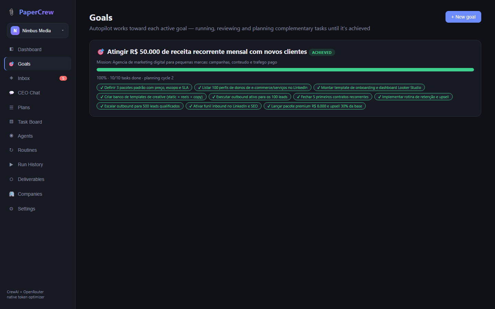
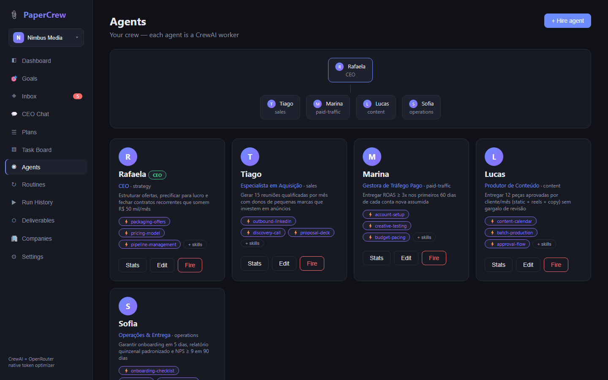
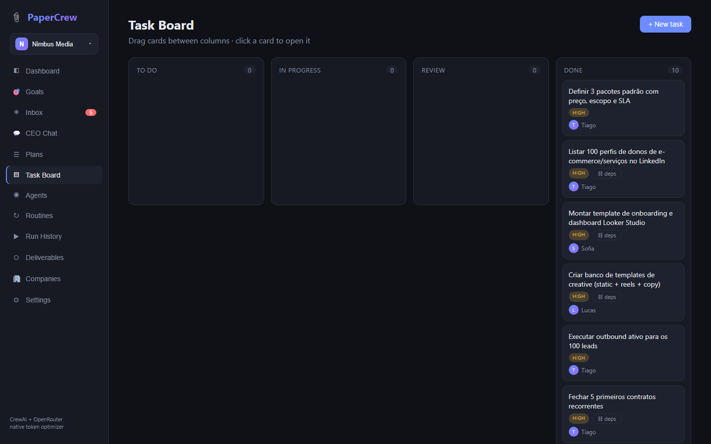
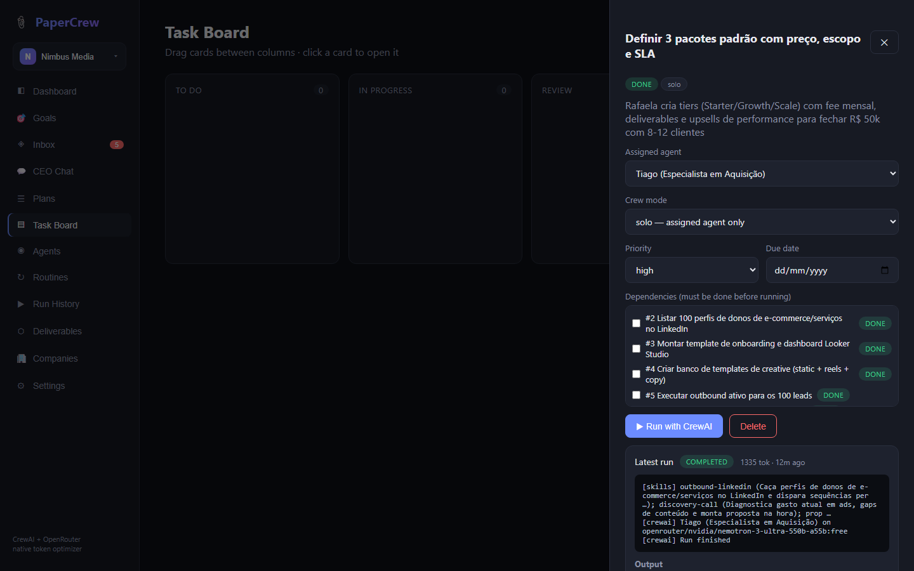
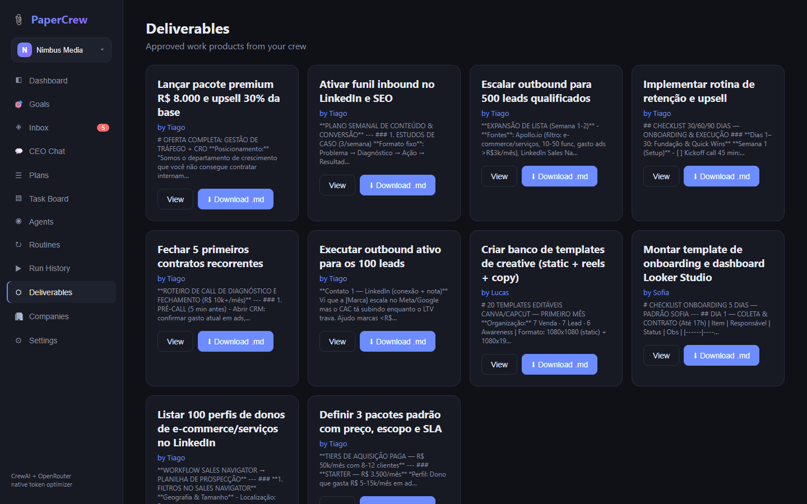
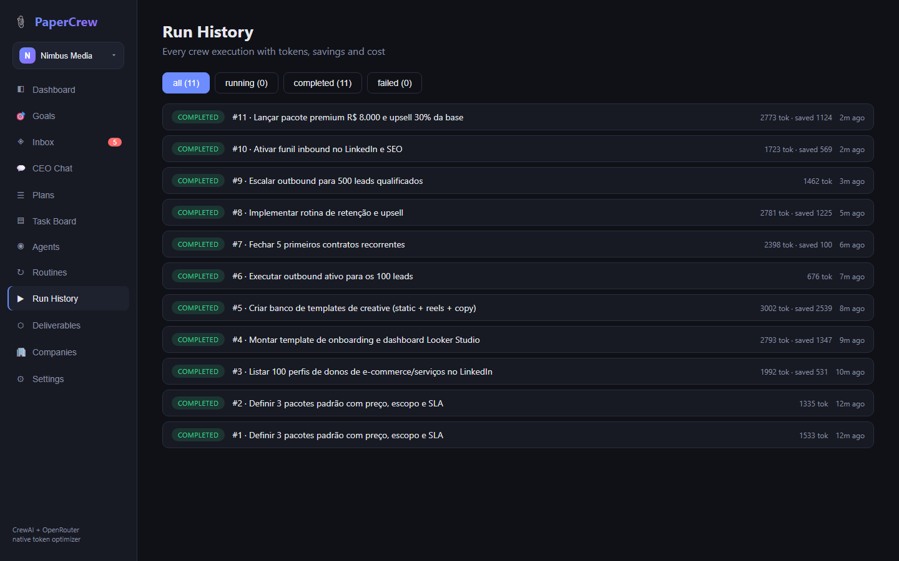
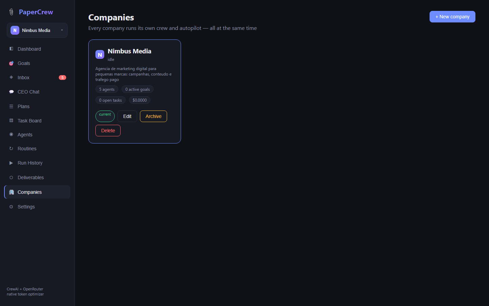

# 📎 PaperCrew

**A Paperclip-style AI company control plane, powered by open-source CrewAI — with a native token optimizer and free OpenRouter models by default.**

PaperCrew solves two problems at once:

- **Paperclip** has a great "AI company" UX but its orchestration burns a lot of tokens.
- **CrewAI** is efficient and open source but has no friendly interface.

PaperCrew gives you the Paperclip experience (CEO chat, delegation, task board, approvals, routines, cost oversight) on top of CrewAI orchestration, wired to OpenRouter with a **free** model as default (`meta-llama/llama-3.3-70b-instruct:free`) — and it actively reduces token usage on every single run.

> PT-BR: interface estilo Paperclip + orquestração CrewAI + otimização nativa de tokens + modelos gratuitos via OpenRouter.

## The magic: describe your company, watch it work

0. **Many companies, at once** — create as many companies as you like. Each owns its crew, goals, board and history, and every one runs its own autopilot **in parallel**. Switch between them from the sidebar; archive one to put it to sleep without losing anything.
1. **Onboarding** — tell PaperCrew a company name, mission and first goal. The CEO **designs a crew for that specific business** — there is no fixed roster. A digital marketing agency chasing recurring revenue gets a strategy-minded CEO plus sales, paid-traffic, content and operations specialists, each with skills that match the role, and it plans in the language you wrote the mission in:

```
Rafaela   [strategy]      CEO                        packaging-offers, pricing-model, pipeline-management
Tiago     [sales]         Especialista em Aquisição  outbound-linkedin, discovery-call, proposal-deck
Marina    [paid-traffic]  Gestora de Tráfego Pago    account-setup, creative-testing, budget-pacing
Lucas     [content]       Produtor de Conteúdo       content-calendar, batch-production, approval-flow
Sofia     [operations]    Operações & Entrega        onboarding-checklist, bi-report, client-comm
```
2. **Autopilot** — agents don't run one prompt and die. For every active goal the autopilot continuously: runs the next ready task → auto-approves results (CEO sign-off) → retries failures with feedback → **plans complementary tasks** when a cycle completes → and only stops when the goal is achieved (or you pause it). Every action is visible in the activity feed.
3. **Self-optimization** — every run passes through the native token optimizer, failed work is retried with the error fed back, and skills sharpen each agent's prompts.

## UX

- **Live toasts** — autopilot, goal and hiring events surface as toasts anywhere in the app, not just on the page that triggered them
- **Sidebar goal widget** — the active goal's progress bar follows you across every page, one click jumps to Goals
- **Empty states everywhere** — every list explains what it's for and offers the action to fill it, instead of a blank page
- **Relative timestamps** — "3m ago" / "just now" on runs and activity, full timestamp on hover
- **Inline feedback** — spinners on long-running actions (CEO planning, crew runs), success/error toasts on every mutation, auto-scrolling run logs
- **One-click example** on onboarding, suggestion chips on CEO chat, keyboard-friendly forms
- **Responsive layout** — sidebar collapses to a top bar on narrow viewports

## Features

| Feature | How it works |
|---|---|
| **Multi-company** | Run several companies side by side — isolated crews, goals, boards, chats and costs; sidebar switcher, per-company model override and budget, archive/restore, and permanent delete guarded by typing the company name |
| **Company onboarding** | One form → the CEO designs a crew for *that* business (roles, specialties and skills are generated, never templated), creates the first goal and plans the opening project |
| **Goals + Autopilot** | Progress-tracked goals; the autopilot works each active goal to completion autonomously (pause/resume anytime) |
| **Skills** | Per-agent skills stored, injected into CrewAI prompts, distributed at onboarding and generatable per agent |
| **CEO Chat** | Describe an objective; the CEO agent breaks it into 2–4 tasks, chains them by dependency and delegates each to the best-fit agent by specialty |
| **Plans** | The CEO drafts a markdown execution plan from your objective; review it, then convert it into dependency-chained tasks with one click |
| **Inbox** | Everything needing your attention in one place: results to review, pending hire requests, failed runs, unassigned tasks — with a live badge |
| **Governance hiring** | Agents join via hire requests that you approve or reject; the CEO files hire requests automatically when a plan needs an uncovered specialty |
| **Agents & org chart** | Hire/fire CrewAI agents with role, goal, backstory, specialty, model override; org chart view and per-agent performance stats (tasks, runs, tokens, cost) |
| **Task board** | Kanban (todo → in progress → review → done) with drag & drop, priorities (low→urgent), due dates with overdue highlighting |
| **Dependencies** | Tasks can depend on other tasks; runs are blocked until dependencies are done, and their outputs feed the prompt as compressed context |
| **Runs** | Each run is a CrewAI crew kickoff — solo (assigned agent) or hierarchical (CEO manager delegates across the whole crew); full run history page with filters |
| **Approvals** | Review results, approve to done, or request changes — the agent re-runs with your feedback in the prompt |
| **Deliverables** | Approved outputs collected as work products, viewable and downloadable as markdown |
| **Comments** | Threaded discussion per task |
| **Routines** | Recurring scheduled work — a routine fires a task (and optionally auto-runs it) every N minutes |
| **Activity feed** | Live company event stream on the dashboard |
| **Cost oversight** | Tokens and cost per run and per agent, monthly budget cap that blocks runs when exceeded |

## Native token optimizer

Every run goes through `backend/app/token_optimizer.py` — no flags needed:

1. **Context graph ("graphify")** — dependency outputs are never injected verbatim. The dependency graph is walked breadth-first (cycle-safe) and each output enters the prompt as a sentence-aware compressed summary within a fixed budget. Savings are measured and stored per run.
2. **Prompt discipline ("ponytail")** — whitespace normalization + duplicate-line removal on all goals/backstories/context, terse-mode style rules appended to every task, and a hard `max_tokens` cap on completions.

The dashboard shows **tokens saved** by the optimizer next to total token usage and cost. All optimizer logic is deterministic and unit-tested.

## Screenshots

All screenshots below are a real run against OpenRouter — no simulated data.

| Dashboard (real tokens, savings, activity) | Goal reached by the autopilot alone |
|---|---|
|  |  |

| Crew designed for this business | Task board after the autopilot worked it |
|---|---|
|  |  |

| Real crew output on a finished task | Deliverables collected |
|---|---|
|  |  |

| Run history with token metrics | Companies |
|---|---|
|  |  |

## Architecture

```
frontend (React + Vite + TS, port 5173)
   │  /api proxy, X-Company-Id header selects the active company
   ▼
backend (FastAPI, port 8000)
   ├─ SQLite — companies own agents, tasks, goals, plans, routines,
   │           hires, chat and events (runs/comments/skills inherit)
   ├─ scheduler ──► fires each company's routines on schedule
   ├─ autopilot ──► works every active goal of every live company, in parallel
   ├─ ceo ────────► chat objective → JSON plan → delegated tasks
   └─ crew_runner ─► token_optimizer ─► CrewAI crew ─► OpenRouter (free default)
```

Requests carry the active company in the `X-Company-Id` header (a `company_id`
query param also works). Omit it and the API falls back to your first company,
so single-company setups and plain `curl` calls need no extra ceremony.

## Quick start

Requirements: Python 3.10–3.13, Node 18+.

```bash
git clone https://github.com/CarlosMagnoSTavares/papercrew
cd papercrew

# backend
python -m venv .venv
.venv/Scripts/pip install -r backend/requirements.txt      # Windows
# .venv/bin/pip install -r backend/requirements.txt        # Linux/macOS
cd backend && ../.venv/Scripts/python -m uvicorn app.main:app --port 8000

# frontend (new terminal)
cd frontend && npm install && npm run dev
```

Open http://localhost:5173 → **Settings** → paste your [OpenRouter API key](https://openrouter.ai/keys) (free tier works) → talk to the CEO.

### An API key is required

PaperCrew has no demo or simulated mode: agents always run on a real model. On
first launch it asks for your OpenRouter key before letting you create a
company, and the default model is **free**, so trying it costs nothing.

## Configuration

| Setting | Where | Default |
|---|---|---|
| OpenRouter API key | Settings page (or `OPENROUTER_API_KEY` env) — global | — |
| Default model | Settings page — global | `meta-llama/llama-3.3-70b-instruct:free` |
| Price per 1k tokens | Settings page — global | 0 (free models) |
| Company name / mission | Companies page → Edit | set at creation |
| Per-company model override | Companies page → Edit | inherits global default |
| Per-company budget cap | Companies page → Edit | 0 (unlimited) |
| Per-agent model | Agent form, "Model override" | inherits company/global |
| Scheduler | `PAPERCREW_SCHEDULER=0` to disable | on |
| Autopilot | `PAPERCREW_AUTOPILOT=0` to disable | on |
| DB path | `PAPERCREW_DB` env | `backend/papercrew.db` |

## Tests

```bash
cd backend && ../.venv/Scripts/python -m pytest tests/ -v
```

Tests stub only the network boundary (`llm.call_text`, `llm.call_json`,
`crew_runner.invoke_crew`) — there is no demo mode to test against — so every
other path runs for real.

**41 tests**: full API coverage (CRUD, validation, dependency blocking, approve/reject feedback loop, CEO planning, hire governance, plan conversion, inbox, work products, agent stats, budget enforcement, routines, events, stats, settings), autonomy tests (company creation builds the crew with skills, **autopilot drives a goal from zero to achieved**, skills injected into runs, goal pause/resume), multi-company tests (**data isolation, blocked cross-company access, two autopilots reaching their goals in parallel**, archive/restore, cascading delete that leaves other companies untouched), tests that **crews differ per business** (a finance mission staffs finance, a dev-tools mission staffs engineering) and that **company creation is refused without an API key**, plus unit tests for the token optimizer. Evidence in [docs/evidence](docs/evidence).

## Roadmap / contributing

PRs welcome! Ideas: streaming run output (SSE), agent tools (web search, files, code), multi-crew projects, LLM-powered dependency summaries, Docker compose, auth for shared deployments.

## License

[MIT](LICENSE)
